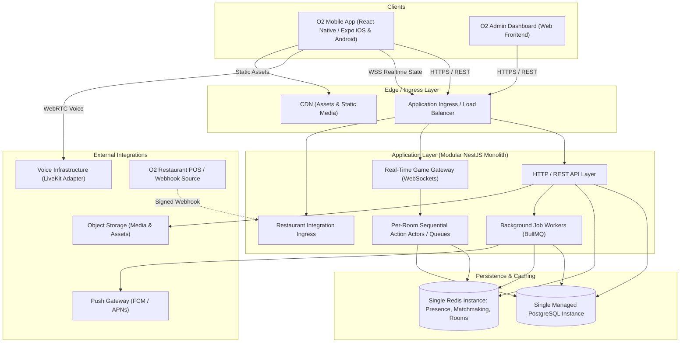

# O2 Universe — Technical Architecture & System Design
**Document Version:** 1.1.0 (Phase 0 Revised Baseline)  
**Status:** Approved Architectural Baseline

---

## 1. High-Level System Architecture

### 1.1 Launch Architecture (Cost-Conscious & Streamlined)
At launch, the architecture avoids premature over-engineering while remaining strictly modular for future scaling:



---

## 2. Monorepo Structure

```
/
├── apps/
│   ├── mobile/             # React Native (Expo Router, TypeScript)
│   ├── admin/              # Admin Dashboard Web App
│   └── api/                # NestJS Core Server (REST + WS Gateways + Workers)
│
├── packages/
│   ├── game-core/          # Deterministic Game Engines (Mafia, Tarneeb, Atrash, HideSeek, Sabotage)
│   ├── types/              # Shared DTOs, Webhook payloads, Enums, Socket Event contracts
│   ├── ui/                 # Shared Cross-Platform UI Design System tokens and primitives
│   ├── config/             # Shared ESLint, Prettier configurations
│   ├── tsconfig/           # Base TypeScript configurations
│   └── eslint-config/      # Base ESLint rules
│
├── docs/                   # Authoritative Architecture & Product Documentation
├── prisma/                 # Database Schema, Migrations, and Seed Scripts
└── package.json            # Turborepo / PNPM Workspace definition
```

---

## 3. Mobile Client Architecture & Rendering Boundary

### 3.1 Technology Stack
* **Framework:** React Native with Expo (current supported stable compatible version at implementation time).
* **Routing:** Expo Router (File-based, deep-link aware).
* **State Management:**
  * **Server State:** TanStack Query (React Query) with offline caching and hydration.
  * **Client State:** Zustand (Active session, user preferences, companion local state, party state).
* **Forms & Validation:** React Hook Form + Zod.
* **Animations:** React Native Reanimated (current supported stable version) + Gesture Handler.
* **Internationalization:** i18next configured with Arabic default **RTL**, and English **LTR**.

### 3.2 Visual Rendering Abstraction (2D / 2.5D / 3D Isolation)
Rendering concerns are strictly isolated from game state and care logic behind a clean contract:
```typescript
// packages/ui/src/companion/types.ts
export interface CompanionRenderProps {
  characterSlug: string;
  mood: 'ecstatic' | 'happy' | 'neutral' | 'sleepy' | 'pouty';
  equippedCosmetics: {
    outfitSlug?: string;
    hatSlug?: string;
    glassesSlug?: string;
    backAccessorySlug?: string;
  };
  currentAnimation: 'idle' | 'eat' | 'bath' | 'sleep' | 'cheer' | 'wave';
  onTap?: () => void;
  scale?: number;
}
```

### 3.3 Spatial Game Runtime Boundary (`GameRuntimeAdapter`)
For spatial games such as *O2 Hide & Seek* and *O2 Imposter (Restaurant Sabotage)*, client rendering is decoupled through a runtime adapter. If mobile web/canvas performance limits 3D gameplay, this boundary allows embedding an optimized native/embedded game runtime (such as Godot/Unity) without rewriting backend network protocols or core app logic.

```typescript
// packages/types/src/runtime.ts
export interface SpatialGameClientProps {
  roomId: string;
  sessionToken: string;
  playerRole: string;
  onGameEvent: (event: string, payload: any) => void;
  onLeave: () => void;
}

export interface IGameRuntimeAdapter {
  mountSpatialGame(containerRef: any, props: SpatialGameClientProps): void;
  unmountSpatialGame(): void;
  sendSpatialAction(action: string, payload: any): void;
}
```

---

## 4. Backend Service Architecture

The backend is built as a modular NestJS monolith (current supported stable compatible version):
1. `AuthModule`: Identity provider linking (Google, Apple, Email/Password via Argon2id) and multi-device `UserSession` management with refresh-token rotation.
2. `CompanionModule`: Care state computation, feeding, bathing, sleep schedules, and non-punitive time-decay.
3. `EconomyModule`: Authoritative `CurrencyLedger` transactions, `WalletBalance` aggregation (Coins, Gems, Event-scoped Tokens), inventory, cosmetic variant compatibility, and reward drops.
4. `SocialModule`: Friend graph, block lists, persistent parties, and user presence.
5. `RealtimeModule`: WebSocket gateway, JWT handshake authentication, heartbeat management, and room dispatch.
6. `GameRoomModule`: Per-room sequential action actors executing deterministic `@o2/game-core` state machines.
7. `MatchmakingModule`: Redis ticket queues for fixed-size human matchmaking.
8. `RestaurantIntegrationModule`: Webhook ingress, cryptographic signature validation, receipt QR processing.
9. `AdminModule`: RBAC guards, campaign configuration, atomic physical reward budget caps, and audit logging.
10. `NotificationModule`: BullMQ background worker integration for FCM/APNs pushes.

---

## 5. Voice Infrastructure Abstraction (`VoiceService`)

```typescript
// packages/types/src/voice.ts
export interface VoiceCredentials {
  roomName: string;
  participantToken: string;
  serverUrl: string;
}

export interface IVoiceService {
  createRoom(roomId: string, maxParticipants: number): Promise<string>;
  generateToken(roomId: string, userId: string, canPublish: boolean): Promise<VoiceCredentials>;
  setParticipantMute(roomId: string, userId: string, muted: boolean): Promise<void>;
  setRoomPublishPermissions(roomId: string, permissions: Record<string, boolean>): Promise<void>;
  closeRoom(roomId: string): Promise<void>;
}
```
* **MVP Scope (Phase 8):** Minimum voice integration for Mafia includes join/leave, speaking indicator, self mute, local mute, server-controlled publish permission, day/night phase permissions, spectator isolation, and reconnect.

---

## 6. Restaurant Integration Abstraction

```typescript
// packages/types/src/restaurant.ts
export interface OrderVerificationPayload {
  orderId: string;
  branchSlug: string;
  customerId?: string;
  orderTotal: number;
  currency: string;
  items: Array<{ menuItemId: string; quantity: number; category: string }>;
  verifiedAt: Date;
}

export interface IRestaurantIntegration {
  verifyWebhookSignature(headers: Record<string, string>, rawBody: string): boolean;
  parseOrderWebhook(payload: any): OrderVerificationPayload;
  validateReceiptToken(signedToken: string): Promise<OrderVerificationPayload>;
}
```

---

## 7. Scaling Path: 100,000+ Registered Users

**Core Scale Target:** "100,000+ registered users, with infrastructure scaling based on measured DAU, peak CCU, concurrent game rooms, voice concurrency, and load-test results."

```
┌─────────────────────────────────────────────────────────────────────────────┐
│                       MEASURED LOAD EVOLUTION MATRIX                        │
├─────────────────────┬───────────────────────────┬───────────────────────────┤
│ METRIC TRIGGER      │ THRESHOLD FOR SCALING     │ TARGET ARCHITECTURE STEP  │
├─────────────────────┼───────────────────────────┼───────────────────────────┤
│ Peak CCU            │ > 1,500 Concurrent Sockets│ Split WS Gateway fleet    │
│                     │                           │ from HTTP API nodes       │
├─────────────────────┼───────────────────────────┼───────────────────────────┤
│ DB Read Latency     │ > 50ms p95 Read Latency   │ Add PostgreSQL Read       │
│                     │                           │ Replica for Shop/Profiles │
├─────────────────────┼───────────────────────────┼───────────────────────────┤
│ Redis Memory / Ops  │ > 25,000 Ops/sec          │ Shard Matchmaking & State │
│                     │                           │ into Redis Cluster        │
├─────────────────────┼───────────────────────────┼───────────────────────────┤
│ Background Jobs     │ Queue Delay > 5 seconds   │ Scale dedicated BullMQ    │
│                     │                           │ Worker process fleet      │
└─────────────────────┴───────────────────────────┴───────────────────────────┘
```

---

## 8. Architectural Decision Records (ADRs)

### ADR-01: Monorepo with Turborepo & PNPM
* **Decision:** Use a single monorepo housing `/apps/mobile`, `/apps/admin`, `/apps/api`, and `/packages/game-core`.
* **Reason:** Guarantees 100% type safety and synchronization between game engine contracts, API payloads, and client logic.
* **Tradeoffs:** Requires upfront workspace configuration.
* **Reconsideration Trigger:** If teams split into independent engineering organizations.

### ADR-02: Append-Only Authoritative Currency Ledger & Scoped Balances
* **Decision:** Track every balance alteration in an immutable, append-only `CurrencyLedger` table with a materialized `WalletBalance` table supporting event-scoped tokens (`(userId, currencyType, scopeId?)`).
* **Reason:** Ensures complete auditability, ACID transaction safety, and prevents mixing seasonal event currencies.
* **Tradeoffs:** Higher database write count per reward event.
* **Reconsideration Trigger:** None; essential for commercial financial integrity.

### ADR-03: Per-Room Sequential Action Actors (No Universal Redlock)
* **Decision:** Process game actions within a room serially using an in-memory/per-room sequential actor queue on the node owning the room. Reserve distributed locks exclusively for room ownership acquisition and node failover.
* **Reason:** Eliminates the latency and overhead of 200ms distributed locks on every individual card or vote action.
* **Tradeoffs:** Room actions must be routed to the owning node via sticky routing or internal pub/sub.
* **Reconsideration Trigger:** If cross-node state synchronization without node affinity is mandated.

### ADR-04: Fixed-Size Public Matchmaking
* **Decision:** Public matchmaking queues require exact player counts (Mafia: 8, Atrash: 5, Tarneeb: 4, Hide & Seek: 8).
* **Reason:** Eliminates matchmaking fragmentation and guarantees balanced games.
* **Tradeoffs:** Players must wait for full rooms in low-traffic hours.
* **Reconsideration Trigger:** If queue analytics demonstrate excessive wait times during off-peak hours.
