# O2 Universe — Database Architecture & Data Domain Model
**Document Version:** 1.1.0 (Phase 0 Revised Baseline)  
**Status:** Approved Architectural Baseline  
**Target RDBMS:** PostgreSQL (current supported stable compatible version) via Prisma ORM

---

## 1. Entity-Relationship Diagram (ERD)

```mermaid
erDiagram
    User ||--o{ AuthIdentity : has
    User ||--o{ UserSession : logs_into
    User ||--|| PlayerProfile : displays
    User ||--o{ WalletBalance : holds
    User ||--|| CharacterState : nurtures
    User ||--o{ InventoryItem : owns
    User ||--o{ EquippedCosmetic : equips
    User ||--o{ CurrencyLedger : transacts
    User ||--o{ Friend : friends
    User ||--o{ PartyMember : joins
    User ||--o{ GameParticipant : seats
    User ||--o{ MatchResult : records_result
    User ||--o{ UserAchievement : achieves
    User ||--o{ MissionProgress : completes
    User ||--o{ UserDrop : receives
    User ||--o{ QRRedemption : redeems
    User ||--o{ RestaurantOrderLink : links

    Character ||--o{ CharacterState : defines
    Character ||--o{ CosmeticVariant : adapts
    
    CosmeticItem ||--o{ CosmeticVariant : contains
    CosmeticItem ||--o{ InventoryItem : instances
    VirtualFood ||--o{ InventoryItem : instances
    InventoryItem ||--o{ EquippedCosmetic : equipped_in
    
    Party ||--o{ PartyMember : contains
    Party ||--o{ GameRoom : enters
    
    GameDefinition ||--o{ GameRoom : instances
    GameRoom ||--o{ GameParticipant : seats
    GameRoom ||--o{ Match : hosts
    Match ||--o{ MatchResult : records

    DropDefinition ||--o{ DropReward : contains
    DropDefinition ||--o{ UserDrop : dispenses
    
    Campaign ||--o{ QRRewardCampaign : executes
    QRRewardCampaign ||--o{ QRRedemption : tracks
    
    RestaurantBranch ||--o{ RestaurantOrderLink : originates
    RestaurantOrderLink ||--o{ OrderReward : grants
```



---

## 2. Exhaustive Schema & Entity Definitions

### 2.1 Identity, Authentication & Multi-Device Sessions

```prisma
enum AuthProvider {
  LOCAL
  GOOGLE
  APPLE
}

enum ModerationStatus {
  ACTIVE
  MUTED
  SUSPENDED
  BANNED
}

enum UserRole {
  PLAYER
  MODERATOR
  RESTAURANT_ADMIN
  SUPER_ADMIN
}

model User {
  id                String            @id @default(uuid()) @db.Uuid
  email             String?           @unique @db.VarChar(255)
  username          String            @unique @db.VarChar(32)
  role              UserRole          @default(PLAYER)
  moderationStatus  ModerationStatus  @default(ACTIVE)
  moderationExpiry  DateTime?         @db.Timestamptz
  lastActiveAt      DateTime          @default(now()) @db.Timestamptz
  createdAt         DateTime          @default(now()) @db.Timestamptz
  updatedAt         DateTime          @updatedAt @db.Timestamptz

  // Relations
  identities        AuthIdentity[]
  sessions          UserSession[]
  profile           PlayerProfile?
  characterState    CharacterState?
  walletBalances    WalletBalance[]
  inventory         InventoryItem[]
  equippedCosmetics EquippedCosmetic[]
  ledgerEntries     CurrencyLedger[]
  friendshipsInitiated Friend[]       @relation("UserFriends")
  friendshipsReceived  Friend[]       @relation("FriendUsers")
  blockedUsers      Block[]           @relation("UserBlocks")
  blockedByUsers    Block[]           @relation("BlockedUsers")
  partyMemberships  PartyMember[]
  ledParties        Party[]           @relation("PartyLeader")
  gameParticipants  GameParticipant[]
  matchResults      MatchResult[]
  achievements      UserAchievement[]
  missions          MissionProgress[]
  drops             UserDrop[]
  qrRedemptions     QRRedemption[]
  orders            RestaurantOrderLink[]
  reportsFiled      ModerationReport[] @relation("ReporterUser")
  reportsAgainst    ModerationReport[] @relation("ReportedUser")
}

model AuthIdentity {
  id                String       @id @default(uuid()) @db.Uuid
  userId            String       @db.Uuid
  provider          AuthProvider
  providerId        String       @db.VarChar(255) // Google sub, Apple sub, or email
  passwordHash      String?      @db.VarChar(255) // Argon2id hash for LOCAL only
  createdAt         DateTime     @default(now()) @db.Timestamptz
  updatedAt         DateTime     @updatedAt @db.Timestamptz

  user              User         @relation(fields: [userId], references: [id], onDelete: Cascade)

  @@unique([provider, providerId])
  @@index([userId])
}

model UserSession {
  id                String       @id @default(uuid()) @db.Uuid
  userId            String       @db.Uuid
  refreshTokenHash  String       @db.VarChar(255)
  familyId          String       @db.Uuid // Refresh token family for rotation/replay protection
  deviceInfo        Json?        @db.JsonB // OS, App Version, Device Model
  ipAddress         String?      @db.VarChar(45)
  createdAt         DateTime     @default(now()) @db.Timestamptz
  expiresAt         DateTime     @db.Timestamptz
  lastUsedAt        DateTime     @default(now()) @db.Timestamptz
  revokedAt         DateTime?    @db.Timestamptz

  user              User         @relation(fields: [userId], references: [id], onDelete: Cascade)

  @@index([userId, revokedAt])
  @@index([familyId])
}

model PlayerProfile {
  id                String       @id @default(uuid()) @db.Uuid
  userId            String       @unique @db.Uuid
  displayName       String       @db.VarChar(64)
  language          String       @default("ar") @db.VarChar(10)
  equippedTitleId   String?      @db.Uuid
  equippedFrameId   String?      @db.Uuid
  notificationsEnabled Boolean   @default(true)
  createdAt         DateTime     @default(now()) @db.Timestamptz
  updatedAt         DateTime     @updatedAt @db.Timestamptz

  user              User         @relation(fields: [userId], references: [id], onDelete: Cascade)
}
```

---

### 2.2 Data-Driven Character & Care Domain

```prisma
model Character {
  id                String            @id @default(uuid()) @db.Uuid
  slug              String            @unique @db.VarChar(64) // panda_mascot, dino_mascot, etc.
  archetype         String            @db.VarChar(64) // panda, dino, bunny, fox, etc.
  nameKey           String            @db.VarChar(64)
  descriptionKey    String            @db.VarChar(255)
  baseAssetSet      Json              @db.JsonB // URIs for base model, idle sprites, animations
  isStarter         Boolean           @default(true)
  isActive          Boolean           @default(true)
  createdAt         DateTime          @default(now()) @db.Timestamptz

  characterStates   CharacterState[]
  variants          CosmeticVariant[]
}

model CharacterState {
  id                String       @id @default(uuid()) @db.Uuid
  userId            String       @unique @db.Uuid
  characterId       String       @db.Uuid
  customName        String?      @db.VarChar(32)
  
  // Care Needs (0.0 to 100.0)
  hunger            Float        @default(100.0)
  cleanliness       Float        @default(100.0)
  energy            Float        @default(100.0)
  mood              Float        @default(100.0)
  
  lastFedAt         DateTime     @default(now()) @db.Timestamptz
  lastBathedAt      DateTime     @default(now()) @db.Timestamptz
  lastSleptAt       DateTime     @default(now()) @db.Timestamptz
  lastInteractedAt  DateTime     @default(now()) @db.Timestamptz

  createdAt         DateTime     @default(now()) @db.Timestamptz
  updatedAt         DateTime     @updatedAt @db.Timestamptz

  user              User         @relation(fields: [userId], references: [id], onDelete: Cascade)
  character         Character    @relation(fields: [characterId], references: [id])
}
```

---

### 2.3 Economy, Append-Only Ledger & Scoped Balances

```prisma
enum CurrencyType {
  O2_COIN
  O2_GEM
  EVENT_TOKEN
}

enum LedgerSource {
  MATCH_REWARD
  DAILY_MISSION
  ACHIEVEMENT
  SHOP_PURCHASE
  COMPANION_FEED
  REAL_ORDER_VERIFIED
  QR_RECEIPT_REDEMPTION
  ADMIN_ADJUSTMENT
  EVENT_REWARD
}

model WalletBalance {
  id                String       @id @default(uuid()) @db.Uuid
  userId            String       @db.Uuid
  currencyType      CurrencyType
  scopeId           String?      @db.VarChar(64) // NULL for Coins/Gems; SeasonId/EventId for EVENT_TOKEN
  balance           BigInt       @default(0)
  updatedAt         DateTime     @updatedAt @db.Timestamptz

  user              User         @relation(fields: [userId], references: [id], onDelete: Cascade)

  @@unique([userId, currencyType, scopeId])
  @@index([userId])
}

model CurrencyLedger {
  id                String        @id @default(uuid()) @db.Uuid
  userId            String        @db.Uuid
  currency          CurrencyType
  scopeId           String?       @db.VarChar(64) // Scoped to Season/Event if applicable
  amount            BigInt        // Positive for credit, negative for debit
  balanceAfter      BigInt        // Snapshot of materialized balance after transaction
  source            LedgerSource
  sourceReferenceId String?       @db.VarChar(255) // MatchId, OrderId, MissionId
  idempotencyKey    String        @unique @db.VarChar(128) // Business event hash
  metadata          Json?         @db.JsonB
  createdAt         DateTime      @default(now()) @db.Timestamptz

  user              User          @relation(fields: [userId], references: [id], onDelete: Cascade)

  @@index([userId, currency, scopeId, createdAt])
  @@index([source, sourceReferenceId])
}
```

---

### 2.4 Cosmetics, Variants & Single Authoritative Equipment

```prisma
enum ItemRarity {
  COMMON
  UNCOMMON
  RARE
  EPIC
  LEGENDARY
  MYTHIC
}

enum CosmeticSlot {
  OUTFIT
  HAT
  GLASSES
  BACK_ACCESSORY
  EMOTE
  PROFILE_FRAME
  CARD_BACK
  TABLE_SKIN
}

model CosmeticItem {
  id                String            @id @default(uuid()) @db.Uuid
  slug              String            @unique @db.VarChar(64)
  nameKey           String            @db.VarChar(64)
  slot              CosmeticSlot
  rarity            ItemRarity        @default(COMMON)
  coinPrice         BigInt?
  gemPrice          Int?
  eventTokenPrice   Int?
  isPurchasable     Boolean           @default(true)
  isSeasonal        Boolean           @default(false)
  seasonId          String?           @db.Uuid
  previewUri        String            @db.VarChar(512)
  createdAt         DateTime          @default(now()) @db.Timestamptz

  variants          CosmeticVariant[]
  inventoryItems    InventoryItem[]
}

model CosmeticVariant {
  id                String        @id @default(uuid()) @db.Uuid
  cosmeticId        String        @db.Uuid
  characterId       String        @db.Uuid // Mascot compatibility mapping
  assetUri          String        @db.VarChar(512)
  anchorMetadata    Json?         @db.JsonB // Offsets, bone attachments, scale factors

  cosmetic          CosmeticItem  @relation(fields: [cosmeticId], references: [id], onDelete: Cascade)
  character         Character     @relation(fields: [characterId], references: [id], onDelete: Cascade)

  @@unique([cosmeticId, characterId])
}

model VirtualFood {
  id                String        @id @default(uuid()) @db.Uuid
  slug              String        @unique @db.VarChar(64)
  nameKey           String        @db.VarChar(64)
  hungerRestore     Float         @default(25.0)
  moodBoost         Float         @default(15.0)
  coinCost          BigInt        @default(50)
  isGoldenVariant   Boolean       @default(false)
  assetUri          String        @db.VarChar(512)
  createdAt         DateTime      @default(now()) @db.Timestamptz

  inventoryItems    InventoryItem[]
}

model InventoryItem {
  id                String            @id @default(uuid()) @db.Uuid
  userId            String            @db.Uuid
  cosmeticId        String?           @db.Uuid
  foodId            String?           @db.Uuid
  quantity          Int               @default(1)
  acquiredAt        DateTime          @default(now()) @db.Timestamptz

  user              User              @relation(fields: [userId], references: [id], onDelete: Cascade)
  cosmetic          CosmeticItem?     @relation(fields: [cosmeticId], references: [id])
  food              VirtualFood?      @relation(fields: [foodId], references: [id])
  equippedInSlots   EquippedCosmetic[]

  @@unique([userId, cosmeticId])
  @@index([userId, foodId])
}

model EquippedCosmetic {
  id                String        @id @default(uuid()) @db.Uuid
  userId            String        @db.Uuid
  slot              CosmeticSlot
  inventoryItemId   String        @db.Uuid // Guarantees player owns the equipped item
  equippedAt        DateTime      @default(now()) @db.Timestamptz

  user              User          @relation(fields: [userId], references: [id], onDelete: Cascade)
  inventoryItem     InventoryItem @relation(fields: [inventoryItemId], references: [id], onDelete: Cascade)

  @@unique([userId, slot]) // Exactly ONE authoritative equipped cosmetic per slot
}
```

---

### 2.5 Social, Party & Multiplayer Games

```prisma
enum FriendshipStatus {
  PENDING
  ACCEPTED
  DECLINED
}

enum PartyStatus {
  OPEN
  IN_MATCH
  DISBANDED
}

model Friend {
  id                String            @id @default(uuid()) @db.Uuid
  userId            String            @db.Uuid
  friendId          String            @db.Uuid
  status            FriendshipStatus  @default(PENDING)
  createdAt         DateTime          @default(now()) @db.Timestamptz
  updatedAt         DateTime          @updatedAt @db.Timestamptz

  user              User              @relation("UserFriends", fields: [userId], references: [id], onDelete: Cascade)
  friend            User              @relation("FriendUsers", fields: [friendId], references: [id], onDelete: Cascade)

  @@unique([userId, friendId])
  @@index([friendId, status])
}

model Block {
  id                String            @id @default(uuid()) @db.Uuid
  userId            String            @db.Uuid
  blockedUserId     String            @db.Uuid
  createdAt         DateTime          @default(now()) @db.Timestamptz

  user              User              @relation("UserBlocks", fields: [userId], references: [id], onDelete: Cascade)
  blockedUser       User              @relation("BlockedUsers", fields: [blockedUserId], references: [id], onDelete: Cascade)

  @@unique([userId, blockedUserId])
}

model Party {
  id                String            @id @default(uuid()) @db.Uuid
  roomCode          String            @unique @db.VarChar(8)
  leaderId          String            @db.Uuid
  status            PartyStatus       @default(OPEN)
  selectedGameSlug  String?           @db.VarChar(32)
  createdAt         DateTime          @default(now()) @db.Timestamptz
  updatedAt         DateTime          @updatedAt @db.Timestamptz

  leader            User              @relation("PartyLeader", fields: [leaderId], references: [id])
  members           PartyMember[]
  rooms             GameRoom[]
}

model PartyMember {
  id                String            @id @default(uuid()) @db.Uuid
  partyId           String            @db.Uuid
  userId            String            @db.Uuid
  isReady           Boolean           @default(false)
  joinedAt          DateTime          @default(now()) @db.Timestamptz

  party             Party             @relation(fields: [partyId], references: [id], onDelete: Cascade)
  user              User              @relation(fields: [userId], references: [id], onDelete: Cascade)

  @@unique([partyId, userId])
  @@index([userId])
}

enum RoomStatus {
  WAITING
  IN_PROGRESS
  FINISHED
  ABANDONED
}

model GameDefinition {
  id                String            @id @default(uuid()) @db.Uuid
  slug              String            @unique @db.VarChar(32)
  nameKey           String            @db.VarChar(64)
  minPlayers        Int
  maxPlayers        Int
  publicMatchCount  Int
  isActive          Boolean           @default(true)
  createdAt         DateTime          @default(now()) @db.Timestamptz

  rooms             GameRoom[]
}

model GameRoom {
  id                String            @id @default(uuid()) @db.Uuid
  gameDefinitionId  String            @db.Uuid
  partyId           String?           @db.Uuid
  roomCode          String            @unique @db.VarChar(12)
  isPublic          Boolean           @default(true)
  status            RoomStatus        @default(WAITING)
  serverNodeId      String            @db.VarChar(64)
  createdAt         DateTime          @default(now()) @db.Timestamptz
  closedAt          DateTime?         @db.Timestamptz

  gameDefinition    GameDefinition    @relation(fields: [gameDefinitionId], references: [id])
  party             Party?            @relation(fields: [partyId], references: [id])
  participants      GameParticipant[]
  matches           Match[]

  @@index([status, isPublic])
}

model GameParticipant {
  id                String            @id @default(uuid()) @db.Uuid
  gameRoomId        String            @db.Uuid
  userId            String            @db.Uuid
  slotIndex         Int
  isSpectator       Boolean           @default(false)
  joinedAt          DateTime          @default(now()) @db.Timestamptz

  gameRoom          GameRoom          @relation(fields: [gameRoomId], references: [id], onDelete: Cascade)
  user              User              @relation(fields: [userId], references: [id], onDelete: Cascade)

  @@unique([gameRoomId, userId])
  @@unique([gameRoomId, slotIndex])
}

model Match {
  id                String            @id @default(uuid()) @db.Uuid
  gameRoomId        String            @db.Uuid
  durationSeconds   Int?              // NULL until match completes
  startedAt         DateTime          @default(now()) @db.Timestamptz
  endedAt           DateTime?         @db.Timestamptz // NULL until match completes
  summary           Json?             @db.JsonB

  gameRoom          GameRoom          @relation(fields: [gameRoomId], references: [id])
  results           MatchResult[]
}

model MatchResult {
  id                String            @id @default(uuid()) @db.Uuid
  matchId           String            @db.Uuid
  userId            String            @db.Uuid
  isWinner          Boolean           @default(false)
  score             Int               @default(0)
  coinsEarned       BigInt            @default(0)
  details           Json?             @db.JsonB

  match             Match             @relation(fields: [matchId], references: [id], onDelete: Cascade)
  user              User              @relation(fields: [userId], references: [id], onDelete: Cascade)

  @@index([userId, matchId])
}
```

---

### 2.6 Restaurant Commerce & QR Security Domain

```prisma
enum RewardType {
  DIGITAL_GEMS
  DIGITAL_DROP
  DIGITAL_COSMETIC
  GOLDEN_FOOD
  PHYSICAL_DISCOUNT
  PHYSICAL_FREE_ITEM
}

enum QRType {
  RECEIPT_ORDER      // Single-use globally, bound to 1 physical order
  CAMPAIGN_MARKETING // Reusable across users, 1 use per eligible user
}

model RestaurantBranch {
  id                String            @id @default(uuid()) @db.Uuid
  slug              String            @unique @db.VarChar(32)
  name              String            @db.VarChar(128)
  isActive          Boolean           @default(true)
  createdAt         DateTime          @default(now()) @db.Timestamptz

  orders            RestaurantOrderLink[]
}

model RestaurantOrderLink {
  id                String            @id @default(uuid()) @db.Uuid
  userId            String            @db.Uuid
  branchId          String            @db.Uuid
  externalOrderId   String            @unique @db.VarChar(128)
  orderTotal        Decimal           @db.Decimal(10, 2)
  verifiedAt        DateTime          @default(now()) @db.Timestamptz
  idempotencyHash   String            @unique @db.VarChar(128)

  user              User              @relation(fields: [userId], references: [id], onDelete: Cascade)
  branch            RestaurantBranch  @relation(fields: [branchId], references: [id])
  rewards           OrderReward[]

  @@index([userId, verifiedAt])
}

model OrderReward {
  id                String            @id @default(uuid()) @db.Uuid
  orderLinkId       String            @db.Uuid
  rewardType        RewardType
  quantity          Int               @default(1)
  referenceId       String?           @db.VarChar(255)
  createdAt         DateTime          @default(now()) @db.Timestamptz

  orderLink         RestaurantOrderLink @relation(fields: [orderLinkId], references: [id], onDelete: Cascade)
}

model Campaign {
  id                String            @id @default(uuid()) @db.Uuid
  title             String            @db.VarChar(128)
  description       String            @db.Text
  startDate         DateTime          @db.Timestamptz
  endDate           DateTime          @db.Timestamptz
  isActive          Boolean           @default(true)
  physicalBudgetCap Decimal?          @db.Decimal(10, 2)
  physicalSpent     Decimal           @default(0.00) @db.Decimal(10, 2)
  createdAt         DateTime          @default(now()) @db.Timestamptz

  qrCampaigns       QRRewardCampaign[]
}

model QRRewardCampaign {
  id                String            @id @default(uuid()) @db.Uuid
  campaignId        String            @db.Uuid
  qrType            QRType            @default(CAMPAIGN_MARKETING)
  codeSlug          String            @unique @db.VarChar(64)
  signingKeyId      String            @db.VarChar(64) // Secret resolved via KMS/Env, not DB row
  maxRedemptions    Int?
  currentRedemptions Int              @default(0)
  rewardType        RewardType
  rewardPayload     Json              @db.JsonB
  expiresAt         DateTime          @db.Timestamptz
  createdAt         DateTime          @default(now()) @db.Timestamptz

  campaign          Campaign          @relation(fields: [campaignId], references: [id])
  redemptions       QRRedemption[]
}

model QRRedemption {
  id                String            @id @default(uuid()) @db.Uuid
  qrCampaignId      String            @db.Uuid
  userId            String            @db.Uuid
  tokenNonce        String            @unique @db.VarChar(128) // Anti-replay nonce
  orderReference    String?           @unique @db.VarChar(128) // Global single-use for RECEIPT_ORDER
  redeemedAt        DateTime          @default(now()) @db.Timestamptz

  qrCampaign        QRRewardCampaign  @relation(fields: [qrCampaignId], references: [id])
  user              User              @relation(fields: [userId], references: [id], onDelete: Cascade)

  @@index([qrCampaignId, userId])
}
```

---

### 2.7 LiveOps, Drops & Moderation

```prisma
model DropDefinition {
  id                String            @id @default(uuid()) @db.Uuid
  slug              String            @unique @db.VarChar(64)
  nameKey           String            @db.VarChar(64)
  tier              ItemRarity        @default(COMMON)
  createdAt         DateTime          @default(now()) @db.Timestamptz

  rewards           DropReward[]
  userDrops         UserDrop[]
}

model DropReward {
  id                String            @id @default(uuid()) @db.Uuid
  dropDefinitionId  String            @db.Uuid
  rewardType        RewardType
  referenceId       String            @db.VarChar(255)
  weightProbability Int

  dropDefinition    DropDefinition    @relation(fields: [dropDefinitionId], references: [id], onDelete: Cascade)
}

model UserDrop {
  id                String            @id @default(uuid()) @db.Uuid
  userId            String            @db.Uuid
  dropDefinitionId  String            @db.Uuid
  isOpened          Boolean           @default(false)
  openedAt          DateTime?         @db.Timestamptz
  grantedReward     Json?             @db.JsonB
  createdAt         DateTime          @default(now()) @db.Timestamptz

  user              User              @relation(fields: [userId], references: [id], onDelete: Cascade)
  dropDefinition    DropDefinition    @relation(fields: [dropDefinitionId], references: [id])
}

model ModerationReport {
  id                String            @id @default(uuid()) @db.Uuid
  reporterUserId    String            @db.Uuid
  reportedUserId    String            @db.Uuid
  reason            String            @db.VarChar(255)
  contextSnapshot   Json?             @db.JsonB
  isResolved        Boolean           @default(false)
  createdAt         DateTime          @default(now()) @db.Timestamptz

  reporter          User              @relation("ReporterUser", fields: [reporterUserId], references: [id])
  reported          User              @relation("ReportedUser", fields: [reportedUserId], references: [id])
}

model AuditLog {
  id                String            @id @default(uuid()) @db.Uuid
  actorUserId       String            @db.Uuid
  action            String            @db.VarChar(64)
  targetEntity      String            @db.VarChar(64)
  targetId          String            @db.VarChar(255)
  previousState     Json?             @db.JsonB
  newState          Json?             @db.JsonB
  ipAddress         String?           @db.VarChar(45)
  createdAt         DateTime          @default(now()) @db.Timestamptz

  @@index([actorUserId, createdAt])
  @@index([targetEntity, targetId])
}
```

---

## 3. Raw PostgreSQL Constraints & Migrations (Prisma Extensions)

The following critical database integrity constraints cannot be expressed directly in Prisma schema syntax and must be applied via raw SQL migrations:

```sql
-- 1. InventoryItem XOR CHECK: Exactly one item type must be referenced
ALTER TABLE "InventoryItem"
ADD CONSTRAINT "chk_inventory_item_type"
CHECK (
  ("cosmeticId" IS NOT NULL AND "foodId" IS NULL) OR
  ("foodId" IS NOT NULL AND "cosmeticId" IS NULL)
);

-- 2. Friendship Symmetry: Prevent reverse duplicate friendships (A-B and B-A)
CREATE UNIQUE INDEX "idx_unique_friendship_pair"
ON "Friend" (LEAST("userId", "friendId"), GREATEST("userId", "friendId"));

-- 3. Party Exclusivity: Prevent a user from belonging to multiple active parties
CREATE UNIQUE INDEX "idx_user_single_active_party"
ON "PartyMember" ("userId")
WHERE "partyId" IN (SELECT "id" FROM "Party" WHERE "status" IN ('OPEN', 'IN_MATCH'));

-- 4. Equipment Ownership Verification: Ensure equipped item belongs to the same user
ALTER TABLE "EquippedCosmetic"
ADD CONSTRAINT "fk_equipped_user_inventory_match"
FOREIGN KEY ("userId", "inventoryItemId")
REFERENCES "InventoryItem" ("userId", "id")
ON DELETE CASCADE;
```
