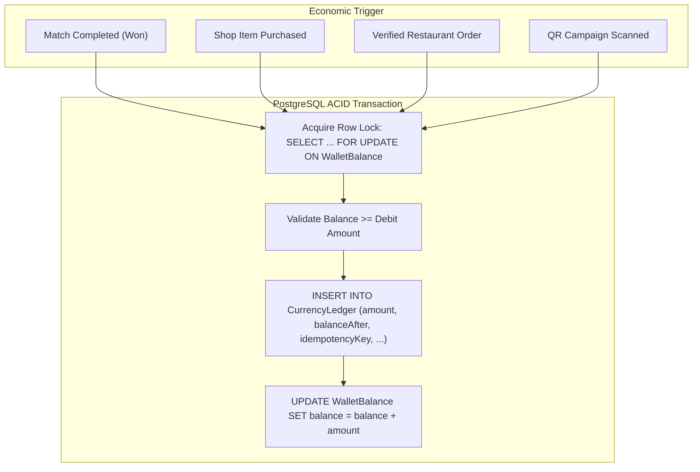

# O2 Universe — Economic System & Financial Ledger Specification
**Document Version:** 1.1.0 (Phase 0 Revised Baseline)  
**Status:** Approved Architectural Baseline

---

## 1. Append-Only Authoritative Currency Ledger

The O2 economy uses an append-only authoritative currency ledger. Balance is never treated as an arbitrary mutable integer without an audit trail, and client claims are never trusted.



### 1.1 Ledger Entry Structure
Every economic movement writes an immutable row into `CurrencyLedger`:
* `id`: UUID
* `userId`: UUID
* `currency`: `O2_COIN` | `O2_GEM` | `EVENT_TOKEN`
* `scopeId`: String? (NULL for Coins/Gems; specific `seasonId`/`eventId` for `EVENT_TOKEN`)
* `amount`: `BigInt` (Positive = Credit, Negative = Debit)
* `balanceAfter`: `BigInt` (The exact materialized balance after this transaction)
* `source`: `MATCH_REWARD` | `DAILY_MISSION` | `ACHIEVEMENT` | `SHOP_PURCHASE` | `COMPANION_FEED` | `REAL_ORDER_VERIFIED` | `QR_RECEIPT_REDEMPTION` | `ADMIN_ADJUSTMENT`
* `sourceReferenceId`: String (Match UUID, Order UUID, or Mission ID)
* `idempotencyKey`: Deterministic business event hash: `SHA-256(userId + ":" + source + ":" + sourceReferenceId + ":" + (scopeId || "GLOBAL"))`

---

## 2. Currency Systems & Scoped Balances (No Global XP)

```
┌──────────────────┬─────────────────────────────┬─────────────────────────────┬───────────────────────────┐
│ CURRENCY         │ PRIMARY SOURCES             │ PRIMARY SINKS               │ SCOPE & STORAGE           │
├──────────────────┼─────────────────────────────┼─────────────────────────────┼───────────────────────────┤
│ 1. O2 Coins      │ • Playing multiplayer games │ • Virtual Companion food    │ Global Scope (`scopeId:   │
│                  │ • Daily Missions            │ • Standard Outfits & Hats   │ NULL`) in `WalletBalance` │
│                  │ • Milestones & Achievements │ • Basic Emotes & Frames     │                           │
├──────────────────┼─────────────────────────────┼─────────────────────────────┼───────────────────────────┤
│ 2. O2 Gems       │ • Verified O2 Food Orders   │ • Epic / Legendary Outfits  │ Global Scope (`scopeId:   │
│                  │ • Major Restaurant Events   │ • Rare Lobby Auras & FX     │ NULL`) in `WalletBalance` │
│                  │ • Milestone Achievements    │ • Exclusive Card Backs      │                           │
├──────────────────┼─────────────────────────────┼─────────────────────────────┼───────────────────────────┤
│ 3. Event Tokens  │ • Seasonal Missions         │ • Limited Seasonal Fashion  │ Strictly Scoped to        │
│                  │ • Holiday Special Events    │ • Event-Exclusive Emotes    │ `seasonId` / `eventId`    │
└──────────────────┴─────────────────────────────┴─────────────────────────────┴───────────────────────────┘
```

---

## 3. Virtual O2 Food vs. Real Food Mechanics

### 3.1 Virtual Food Menu (Purchased with Coins)
* **O2 Mini Shawarma:** Cost 40 Coins $\rightarrow$ Restores +30 Hunger, +10 Mood.
* **O2 Cheesy Pizza Slice:** Cost 60 Coins $\rightarrow$ Restores +45 Hunger, +15 Mood.
* **O2 Crispy Fries:** Cost 30 Coins $\rightarrow$ Restores +20 Hunger, +10 Mood.
* **O2 Craft Burger:** Cost 75 Coins $\rightarrow$ Restores +60 Hunger, +25 Mood.
* **O2 Gelato Cup:** Cost 50 Coins $\rightarrow$ Restores +25 Hunger, +35 Mood.

### 3.2 Golden Food Variants (Unlocked via Real Restaurant Orders)
When a real restaurant order is verified (e.g., an authentic O2 dessert), the player receives an exclusive **Golden Gelato** or **Golden Cake** in their inventory.
* *Effect:* Restores +100% Hunger, triggers a golden sparkle aura animation around the companion, and records an entry in the permanent Collection.

---

## 4. Item Rarities & Reveal Experience

```
┌──────────────┐     ┌──────────────┐     ┌──────────────┐     ┌──────────────┐     ┌───────────────┐     ┌──────────────┐
│    COMMON    │ ──► │   UNCOMMON   │ ──► │     RARE     │ ──► │     EPIC     │ ──► │   LEGENDARY   │ ──► │    MYTHIC    │
│  (Grey/Base) │     │    (Green)   │     │    (Blue)    │     │   (Purple)   │     │  (Gold / FX)  │     │ (Prismatic)  │
└──────────────┘     └──────────────┘     └──────────────┘     └──────────────┘     └───────────────┘     └──────────────┘
```

* **Reveal Moments:** Opening reward drops of Legendary or Mythic tier triggers a celebratory particle reveal animation.
* **Collection Progress:** Every cosmetic item belongs to a slot and category. Total unlocks are tracked per category without global player XP.

---

## 5. Reward Drops & Atomic Physical Budget Enforcement

### 5.1 Non-Gambling Policy
1. Reward Drops are **never sold for real money** or purchasable as paid loot boxes.
2. Drops are earned solely through gameplay achievements, seasonal events, and real dining reward campaigns.

### 5.2 Atomic Physical Reward Allocation
To ensure the restaurant never exceeds promotional caps under high concurrency, physical vouchers are allocated atomically:

```sql
-- Atomic Budget Check & Allocation Transaction
BEGIN;

-- 1. Lock Campaign row for update
SELECT "physicalBudgetCap", "physicalSpent"
FROM "Campaign"
WHERE "id" = :campaignId
FOR UPDATE;

-- 2. Validate budget availability in server logic
-- IF (physicalSpent + voucherCost <= physicalBudgetCap):
UPDATE "Campaign"
SET "physicalSpent" = "physicalSpent" + :voucherCost
WHERE "id" = :campaignId;

-- 3. Issue physical voucher reward
INSERT INTO "UserDrop" ("userId", "dropDefinitionId", "grantedReward", "isOpened")
VALUES (:userId, :dropDefId, :physicalRewardPayload, true);

COMMIT;
```
* **Graceful Fallback:** If the physical cap is reached, the engine automatically substitutes a high-tier digital cosmetic or Gems reward.

---

## 6. Secure QR Architecture (Receipt vs. Campaign QR)

```
┌───────────────────────────────────────────────┬───────────────────────────────────────────────┐
│ A. RECEIPT / ORDER QR                         │ B. EVENT / BRANCH CAMPAIGN QR                 │
├───────────────────────────────────────────────┼───────────────────────────────────────────────┤
│ • Printed on one verified restaurant bill.    │ • Displayed on posters, flyers, or tables.    │
│ • Strictly single-use GLOBALLY.               │ • Reusable across multiple unique users.      │
│ • Enforced via `orderReference` unique index. │ • Enforced via `(qrCampaignId, userId)` index │
│ • Cannot be claimed by another account.       │   (1 redemption per eligible user).           │
└───────────────────────────────────────────────┴───────────────────────────────────────────────┘
```

* **Key Management:** QR signing secrets are **never stored in plaintext database rows**. The database stores a `signingKeyId`, and the backend resolves the cryptographic key securely from KMS / environment configuration.
