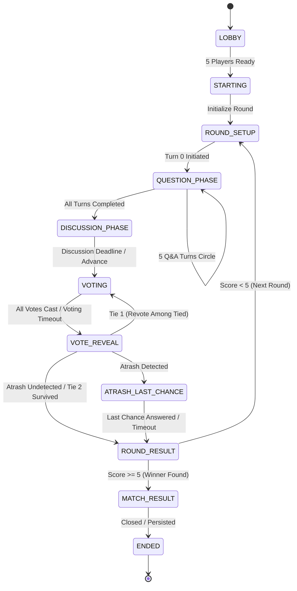

# أطرش بالزفة (Atrash Bel Zaffeh) — Game Design & Technical Specification

> **O2 Universe — Phase 7 Flagship Multiplayer Game**
> Server-Authoritative, Deterministic Social Deduction Party Game

---

## 1. Executive Summary & Game Concept

**أطرش بالزفة (Atrash Bel Zaffeh)** is the first complete multiplayer online game built on top of the O2 Universe authenticated realtime infrastructure, room engine, and matchmaking foundation.

- **Genre**: Social deduction / bluffing / Q&A party game in an authentic Arabic setting.
- **Theme & Presentation**: Set in a cozy, stylized O2 restaurant where 5 cute companion avatars sit around a round table.
- **Core Loop**:
  - Each round, a secret word is selected from a chosen category.
  - **4 Informed Players** know the secret word and the category.
  - **1 Atrash Player** knows only the broader category, but is blind to the exact word.
  - A structured 5-turn cycle of subtle, indirect questions and answers takes place.
  - After a short discussion phase, players cast secret votes to unmask the Atrash.
  - If caught, the Atrash gets a tense **Last Chance** to guess the word from 4 options.
  - Points are awarded, and the first player to accumulate **5 points** wins the match.

---

## 2. Player Count & Public Matchmaking

- **Public Match Count**: Strictly **5 human players**.
- **No Bots**: Public mode never fills slots with bots or AI agents.
- **Unique Authenticated Identities**: Duplicate user identities in the same room are strictly prohibited.
- **Private Room Support**: Private rooms share the identical game engine and allow groups formed via party or room codes.

---

## 3. Role Model & Secrecy

| Role | Count | Information Received | Objective |
| :--- | :---: | :--- | :--- |
| **Informed** (`INFORMED`) | 4 | Category + Secret Word | Ask and answer without leaking the secret word; vote correctly for the Atrash. |
| **Atrash** (`ATRASH`) | 1 | Category ONLY (Secret Word = `undefined`) | Blend in, deduce the secret word from questions, survive voting or guess in Last Chance. |

### Strict Zero-Leakage Invariant
The server is authoritative for role assignment and secret selection.
- The secret word is **never** present in public room projections, room snapshots, events, server logs, spectator views, or reconnect snapshots.
- The Atrash's private player projection explicitly sets `secretWord = undefined`.
- The secret is only revealed to all participants during the final `ROUND_RESULT` and `MATCH_RESULT` stages.

---

## 4. Game State Machine

### Legal Transitions
All state transitions are strictly validated. Any invalid transition throws `AtrashEngineError(INVALID_PHASE_TRANSITION)` and fails safely without corrupting memory.

---

## 5. Turn System & Ordering

- **Structure**: Exactly 5 turns per round in a deterministic circle:
  - Turn 0: Player 0 asks $\rightarrow$ Player 1 answers
  - Turn 1: Player 1 asks $\rightarrow$ Player 2 answers
  - Turn 2: Player 2 asks $\rightarrow$ Player 3 answers
  - Turn 3: Player 3 asks $\rightarrow$ Player 4 answers
  - Turn 4: Player 4 asks $\rightarrow$ Player 0 answers
- **Stages**: Each turn consists of `ASKING` $\rightarrow$ `ANSWERING`.
- **Validation**:
  - Out-of-turn actions are immediately rejected with `NOT_YOUR_TURN`.
  - Duplicate actions are rejected with `INVALID_TURN_STAGE`.
  - Deterministic anti-leak content filter rejects questions explicitly asking for the word, spelling, first letter, or letter count (`PROHIBITED_DIRECT_QUESTION`).

---

## 6. Server-Owned Timers

All authoritative timers are owned by `RoomTimerRegistry` on the backend:
- **Turn Timer**: 25 seconds per ask / answer step. If expired, server automatically applies a neutral fallback dialogue.
- **Discussion Timer**: 30 seconds.
- **Voting Timer**: 20 seconds.
- **Last Chance Timer**: 15 seconds.
- **Suspense / Reveal Pauses**: 5–8 seconds between phases for animations.

Clients render responsive countdowns, but the server clock is 100% authoritative.

---

## 7. Voting & Tie Handling

1. **Secret Voting**: Each active player casts 1 vote for an opponent (`CANNOT_VOTE_FOR_SELF`).
2. **Secrecy**: Targets are concealed until the official `VOTE_REVEAL` phase.
3. **Tie Resolution Rules**:
   - If two or more candidates tie for highest votes on the first vote:
     - The game enters **Revote Mode** (`isRevote = true`).
     - A short defense window is granted, followed by a revote restricted to the tied candidates.
   - If the revote results in a **second tie**:
     - The **Atrash survives!** The round resolves in the Atrash's favor with +2 survival points.

---

## 8. Atrash Last Chance

- Triggered only when the Atrash is correctly detected by majority vote.
- The server generates **exactly 4 candidate words**:
  - The 1 correct secret word.
  - 3 plausible distractors from the same or related category.
- If the Atrash chooses correctly within 15 seconds:
  - The Atrash earns **+1 point**.
- If incorrect or timed out:
  - 0 bonus points.

---

## 9. Scoring & Race-to-5 Victory

### Point System
- **Informed Voters**: **+1 point** for each player who correctly voted for the true Atrash.
- **Atrash Evasion**: **+2 points** if the Atrash was not the most-voted player or survived a revote tie.
- **Atrash Last Chance**: **+1 point** if the caught Atrash correctly guesses the secret word.

### Race-to-5 Match Victory
- The first player to reach **5 cumulative points** at the conclusion of a round wins the match.
- If multiple players cross 5 in the same round, the player with the highest total score wins. If still tied, play continues until an outright leader emerges.

---

## 10. Role Fairness Strategy

To prevent the same player from repeatedly being assigned as Atrash:
1. The engine tracks `atrashHistory: Record<string, number>` across rounds.
2. The engine filters for players who have served as Atrash the fewest times.
3. If multiple candidates exist, the immediate previous Atrash is excluded.
4. Selection from eligible candidates is executed deterministically using a seeded pseudo-random number generator (PRNG).

---

## 11. Content System & Expansion

The content architecture is decoupled from engine mechanics into `atrash.content.ts`.
Initial categories:
1. `daily_life` (حياة يومية)
2. `food` (أكلات ومطاعم)
3. `sports` (رياضة وتحدي)
4. `movies` (سينما ومسلسلات)
5. `palestine` (فلسطين الحبيبة)
6. `gaming` (ألعاب وجيمينج)
7. `funny_scenarios` (مواقف طريفة)
8. `o2_special` (عالم O2 الخاص)

Each entry defines `word`, `categorySlug`, `hintsAr`, and `distractors` for last-chance options. Future packs can be loaded dynamically or via seasonal updates without changing game engine code.

---

## 12. Reconnect & Anti-Cheat Security

- **Disconnect Grace**: Disconnected players are assigned `DISCONNECTED_GRACE` for 60 seconds.
- **Sanitized Recovery**: Reconnecting players receive a freshly projected state through `recoverRoom()`.
- **Anti-Spoofing**: Non-member actions are blocked. Identity claims are derived purely from authenticated JWT context.
- **Idempotency**: Duplicate actions with identical `actionId` return cached results without double mutations.

---

## 13. Persistence Boundary

- **Ephemeral**: Turns, dialogue history, and interim votes reside strictly in server memory (`RoomSequentialExecutor` and `AtrashGameEngine`).
- **Durable**: Upon `MATCH_RESULT`, `GameHistoryService` transactionally records the finished match into the PostgreSQL table `game_match_history` (recording `matchId`, `winnerUserId`, `participants`, `finalScores`, and `totalRounds`).

---

## 14. Analytics Instrumentation

The following 10 telemetry events are instrumented with zero secret leakage:
1. `atrash_matchmaking_started`
2. `atrash_match_started`
3. `atrash_round_started`
4. `atrash_question_submitted`
5. `atrash_vote_started`
6. `atrash_vote_cast`
7. `atrash_round_completed`
8. `atrash_match_completed`
9. `atrash_abandoned`
10. `atrash_reconnected`
