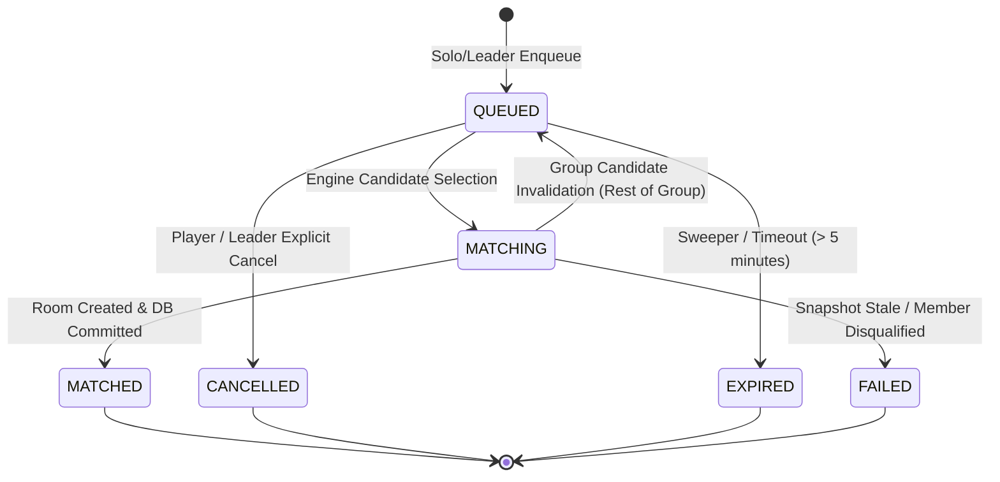

# Phase 6E: Server-Authoritative Matchmaking Foundation

## 1. Overview & Architectural Boundaries

Phase 6E delivers a secure, deterministic, server-authoritative matchmaking foundation for the O2 platform. It manages matchmaking tickets, queue concurrency, exact-capacity validation, party-as-a-unit grouping, and automatic ephemeral room provisioning.

> **CRITICAL BOUNDARY INVARIANT**
> Phase 6E is exclusively responsible for **matchmaking coordination and room creation**.
> - **DOES NOT** implement game rules, role assignments, card dealing, turns, or scoring (deferred to Phase 7 & 8).
> - **DOES NOT** integrate Voice, audio streams, or LiveKit (deferred to Phase 6F).
> - **DOES NOT** introduce external Redis clustering (designed as an in-memory sequential engine with transactional PostgreSQL persistence).
> - **DOES NOT** connect restaurant, QR, or reward redemption systems.

---

## 2. Matchmaking Architecture

```mermaid
graph TD
    Client[Client / Mobile App] -->|POST /matchmaking/queue| Controller[MatchmakingController]
    Controller -->|joinQueue| Service[MatchmakingServiceCore]
    Service -->|Atomic Tx & Row Lock| DB[(PostgreSQL Tickets & Members)]
    Service -->|tryMatchQueue| Engine[MatchmakingEngineCore]
    Engine -->|Sequential Executor| EngineQueue[Per-Mode Serial Queue]
    EngineQueue -->|findExactCapacityGroup| Rules[@o2/game-core Match Rules]
    Rules -->|Exact Capacity Selection| Engine
    Engine -->|Revalidate Eligibility| DB
    Engine -->|createMatchRoom| RoomManager[Phase 6B RoomManager]
    RoomManager -->|Room State: READY| Engine
    Engine -->|Commit MATCHED State| DB
    Engine -->|Commit-Then-Publish| Notifier[MatchmakingRealtimeNotifier]
    Notifier -->|matchmaking:matched| Gateway[Realtime Server / Gateway]
    Gateway -->|WebSocket Push| Client
    Client -.->|GET /matchmaking/status| Controller
```

---

## 3. Ticket Lifecycle State Machine

The state machine governs ticket transitions with absolute strictness:



### State Definitions:
1. **`QUEUED`**: The ticket is actively waiting in the FIFO queue.
2. **`MATCHING`**: The engine selected this ticket as part of an exact-capacity candidate group and is running snapshot revalidation and room assignment.
3. **`MATCHED`**: All candidates passed validation, ephemeral room was provisioned in `RoomManager`, and the match assignment committed.
4. **`CANCELLED`**: Explicitly cancelled by the solo player or party leader before match completion.
5. **`EXPIRED`**: Ticket exceeded maximum waiting duration (`TICKET_TIMEOUT_MS = 300,000ms`).
6. **`FAILED`**: Ticket failed snapshot revalidation (e.g., party composition changed, member became muted/banned/in another room).

---

## 4. Solo Player & Party-as-One-Unit Semantics

### Solo Player Queue
- An authenticated player queuing alone receives a ticket with `memberCount: 1`, `partyId: null`, `partyVersion: null`.
- Only one active ticket per user is permitted system-wide.

### Party-as-One-Unit Invariant
- A party enters matchmaking as a single indivisible unit.
- **NEVER SPLIT**: The matchmaking algorithm (`findExactCapacityGroup`) never splits a party. Either all members of the party enter the same match together, or none do.
- **Leader Authority**: Only the party leader (`party.leaderUserId === callerId`) may initiate queue entry or cancellation.
- **Member Readiness**: All party members must have `readyState === 'READY'` at the instant of queue entry.
- **Capacity Compatibility**: A party whose size exceeds game capacity cannot enter queue (e.g., party of 5 cannot queue for Tarneeb whose capacity is 4).
- **Snapshot Immutability**: At enqueue time, the ticket snapshots `partyId`, `partyVersion`, and exact member user IDs.

---

## 5. Exact Game Capacities

Game modes and their required capacities are strictly enforced from `@o2/types`:

| Game Mode | Exact Capacity | Party Size Allowed | Description |
| :--- | :---: | :---: | :--- |
| **`ATRASH`** | **5** | 1 to 5 | Classic card game |
| **`MAFIA_CLASSIC`** | **14** | 1 to 14 | Social deduction party game |
| **`TARNEEB`** | **4** | 1 to 4 | 4-player trick-taking card game |
| **`HIDE_AND_SEEK`** | **8** | 1 to 8 | 8-player arena game |
| **`O2_IMPOSTER`** | **8** | 1 to 8 | Space sabotage & deduction |

- **No partial matches**: A match is never created with fewer players than exact capacity.
- **No overfill**: A match is never created with more players than exact capacity.
- **Opponent choice**: Players cannot choose opponents or inject participant lists; pairing is 100% server-authoritative.

---

## 6. FIFO Ordering & Fairness Strategy

1. Queued tickets are ordered by `createdAt ASC`.
2. The search algorithm (`findExactCapacityGroup`) evaluates candidate combinations starting from the oldest queued ticket.
3. If the oldest ticket is a party that cannot immediately fit the remaining capacity with available tickets, the search attempts to greedily fill from subsequent tickets while prioritizing queue seniority.
4. If a candidate group fails snapshot revalidation, valid tickets revert to `QUEUED` while **preserving their original `createdAt` timestamp**, retaining their queue priority.

---

## 7. Concurrency Strategy & Race Condition Protection

### 1. Same-User / Same-Party Enqueue Race
- Enqueue checks and ticket creation are wrapped in an atomic database transaction (`prisma.$transaction`).
- When multiple requests for the same user or party arrive simultaneously, the transaction serializes execution.
- The first request creates the ticket; subsequent concurrent requests detect the active ticket and reject with `ALREADY_QUEUED (409)`.

### 2. Matchmaking Engine Serial Execution (`MatchmakingSequentialExecutor`)
- Per-game-mode queues are processed serially using a promise chain executor.
- This prevents two matching scans from evaluating the same tickets simultaneously.

### 3. State Transition Lock (`QUEUED -> MATCHING`)
- Before matching, candidates are transitioned from `QUEUED` to `MATCHING` in an atomic database update:
  ```sql
  UPDATE "matchmaking_tickets"
  SET "status" = 'MATCHING'
  WHERE "id" IN (...) AND "status" = 'QUEUED'
  ```
- If `affectedRows !== candidateIds.length`, a race occurred (e.g., ticket cancelled concurrently). The engine rolls back any touched tickets to `QUEUED` and aborts the batch.

### 4. Cancel vs Match Race
- Cancellation executes `UPDATE ... WHERE id = ticketId AND status = 'QUEUED'`.
- If the ticket has already transitioned to `MATCHING` or `MATCHED`, the update count is `0`, and cancellation is safely rejected with `CANNOT_CANCEL_MATCHED (409)`.
- If cancellation succeeds, the engine's atomic state transition will detect the missing ticket and skip matching.

---

## 8. Snapshot Validation & Revalidation Before Matching

Immediately after locking candidate tickets into `MATCHING`, the engine revalidates eligibility against the database:

1. **Moderation Status**: Every participant must still be `ACTIVE`. If banned/muted/suspended, ticket is rejected.
2. **Room Collision**: Neither the user nor any party member may have entered an active room elsewhere.
3. **Party Version & Membership Check**:
   - Query fresh party record from PostgreSQL.
   - Verify `party.status === 'ACTIVE'`.
   - Verify `party.version === ticket.partyVersion`.
   - Verify all member user IDs still match the snapshot.
4. **Failure Handling**:
   - If a party ticket fails revalidation, it transitions to `FAILED`.
   - Any innocent tickets in the candidate group transition back to `QUEUED`.

---

## 9. Room Engine Integration

When a match group is formed:
1. `MatchmakingEngineCore` calls `RoomManager.createMatchRoom(gameMode, participants)`.
2. `createMatchRoom` creates an ephemeral room with exact capacity, adds all participants with `status: 'READY'`.
3. Because all slots are filled, `Room.addParticipant` automatically advances the room lifecycle from `WAITING` to `READY`.
4. The generated `roomId` is committed to PostgreSQL in the `MatchmakingTicket` record (`status: 'MATCHED'`, `roomId: roomId`, `matchId: matchId`).
5. **No gameplay is triggered**. Room state stops at `READY`.

---

## 10. Realtime Notifications & HTTP Fallback

### Realtime Push
- Pattern: **Commit-Then-Publish**.
- Events are emitted only after the database transaction successfully commits:
  - `matchmaking:ticket_status`: Dispatched to player/party when ticket is queued.
  - `matchmaking:matched`: Dispatched to all match participants with `MatchAssignmentDto`.
  - `matchmaking:ticket_cancelled`: Dispatched if ticket is cancelled.

### HTTP Polling Fallback
- `GET /matchmaking/status` provides a resilient fallback for mobile clients experiencing socket disconnects or packet drops.
- Returns current ticket status and match details if matched within the last 5 minutes.

---

## 11. Timeout & Sweeper Cleanup

- **TTL**: Tickets expire after 5 minutes (`300,000ms`).
- **Periodic Sweeper**: Runs every 15 seconds (`SWEEP_INTERVAL_MS`), transitioning expired `QUEUED` tickets to `EXPIRED`.
- **Read-time Cleanup**: `getQueueStatus` lazily marks expired tickets as `EXPIRED` upon query.

---

## 12. Future Boundaries & Non-Goals

1. **Future Redis Boundary**:
   - When transitioning from single-node to multi-node clusters in production, `MatchmakingSequentialExecutor` and DB queue polling will be replaced by Redis Sorted Sets (`ZADD`, `ZRANGEBYSCORE`, Redis Lua scripts).
   - The `@o2/game-core` pure rules (`findExactCapacityGroup`) and DTO contracts remain completely unchanged.
2. **Future Reconnect Boundary**:
   - If a player disconnects while in `QUEUED` state, their ticket remains active until timeout or explicit cancel.
   - If a player disconnects after `MATCHED`, state recovery restores their room placement via Phase 6D mechanisms.
3. **Gameplay & Voice**:
   - Game rules, role dealing, turn management, and Voice/LiveKit are strictly deferred to Phase 6F, 7, and 8.
