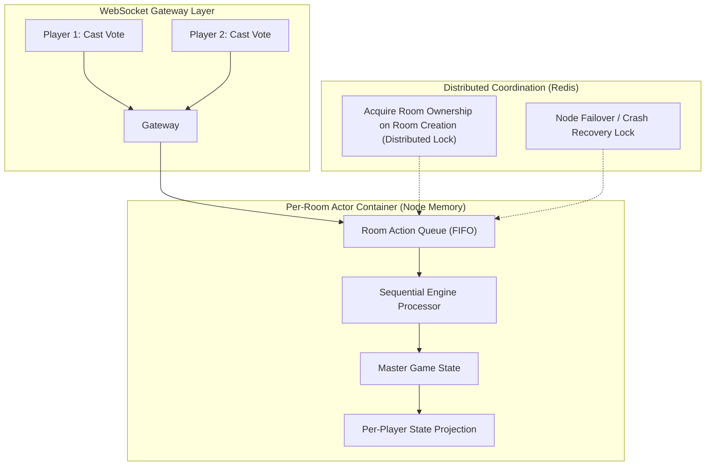
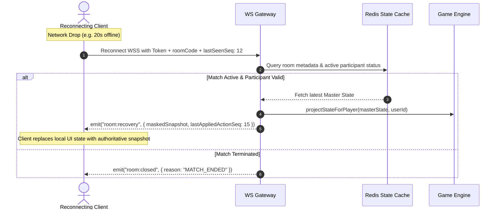

# O2 Universe — Real-Time Game & Networking Architecture
**Document Version:** 1.1.0 (Phase 0 Revised Baseline)  
**Status:** Approved Architectural Baseline

---

## 1. WebSocket Gateway & Connection Lifecycle

```mermaid
sequenceDiagram
    autonumber
    actor Client as O2 Mobile Client
    participant LB as Load Balancer (WSS)
    participant Gateway as NestJS WS Gateway
    participant Redis as Redis Presence & State
    participant Actor as Per-Room Sequential Actor

    Client->>LB: Connect WSS with Bearer JWT
    LB->>Gateway: Forward Handshake Connection
    Gateway->>Gateway: Verify JWT Signature & User Status
    alt Token Invalid / Expired
        Gateway-->>Client: 4001 Unauthorized Disconnect
    else Token Valid
        Gateway->>Redis: SET user:presence:{userId} = ONLINE (TTL 45s)
        Gateway-->>Client: Connection Established (socketId, serverTimestamp)
    end

    loop Heartbeat (Every 15s)
        Client->>Gateway: PING
        Gateway->>Redis: EXPIRE user:presence:{userId} 45s
        Gateway-->>Client: PONG
    end

    Client->>Gateway: emit("room:action", { roomCode, actionType, payload, clientActionSeq })
    Gateway->>Actor: Enqueue action to room actor queue
    Actor->>Actor: Process action sequentially (Server timestamp assigned)
    Actor-->>Gateway: Broadcast per-player projected state
    Gateway-->>Client: emit("room:state_sync", { maskedSnapshot, lastAppliedActionSeq })
```

---

## 2. Server-Authoritative Game Engine Architecture (`@o2/game-core`)

All game logic operates inside a deterministic, side-effect-free state machine architecture packaged in `packages/game-core`. The server is the **sole source of truth**.

```typescript
// packages/game-core/src/common/engine.interface.ts

export interface GameAction<TPayload = any> {
  actionId: string;
  userId: string;
  type: string;
  payload: TPayload;
  clientActionSeq: number;
  serverTimestamp: number; // Server-assigned authoritative timestamp
}

export interface GameValidationResult {
  isValid: boolean;
  errorCode?: string;
  errorMessage?: string;
}

export interface IGameEngine<TState, TConfig, TPlayerProjection = any> {
  initializeState(config: TConfig, players: string[]): TState;
  validateAction(state: TState, action: GameAction): GameValidationResult;
  processAction(state: TState, action: GameAction): {
    nextState: TState;
    events: Array<{ recipient: 'ALL' | string; event: string; data: any }>;
  };
  projectStateForPlayer(state: TState, userId: string): TPlayerProjection;
  checkWinCondition(state: TState): { isFinished: boolean; winnerTeamOrPlayer?: string; scores?: Record<string, number> };
  onTimerTick(state: TState, deltaMs: number): { nextState: TState; phaseChanged: boolean };
}
```

### 2.1 Per-Player State Projection & Secret-State Redaction
Master game states containing secret roles, full decks, and saboteur identities **never enter a client serialization path**.
* When broadcasting, the server executes `projectStateForPlayer(masterState, player.id)` for each participant individually.
* **Mafia Projection:** A living Citizen receives `role: "CITIZEN"` and all other roles as `"UNKNOWN"`. Mafia players receive their teammates' identities.
* **Tarneeb Projection:** A player receives only `myHand: Card[]`, `currentTrick: Card[]`, and historical trick scores. Opponent hand arrays are entirely absent.

---

## 3. Per-Room Sequential Action Execution (No Universal Redlock)



* **Deterministic Actor Model:** Each active game room runs a dedicated sequential FIFO action queue in memory on the node assigned to that room.
* **Distributed Locks (`Redlock`):** Reserved exclusively for **Room Ownership Acquisition** when a match starts and **Node Failover** if a gateway crashes. High-frequency actions (votes, cards) are processed serially without the latency of network-bound distributed locks.

---

## 4. Reconnection & Deterministic State Recovery



### 4.1 Reconnection Rules
1. **Authoritative Masked Snapshot Strategy:** Upon reconnecting, the server transmits the **latest authoritative `maskedSnapshot`** along with `lastAppliedActionSeq`. The client replaces its projection state, avoiding corrupt state diffs.
2. **Grace Periods:**
   * **Tarneeb / Card Games:** 45 seconds before the engine auto-plays a legal default card.
   * **Mafia / Social Games:** 90 seconds during discussions; if absent during voting, the vote is counted as abstained.
3. **Room TTL Refresh:** Every processed action automatically extends the Redis room state key TTL by 1 hour.

---

## 5. Fixed-Player Matchmaking Architecture

* **Strict Human Matchmaking Counts (V1):**
  * **Mafia:** Exactly 8 Human Players (no AI bots in V1).
  * **Atrash Bel Zaffeh:** Exactly 5 Human Players.
  * **Tarneeb:** Exactly 4 Human Players (2v2).
  * **O2 Hide & Seek:** Exactly 8 Human Players (4 Hiders vs 4 Seekers).
* **Anti-Fragmentation:** Public matchmaking queues never fragment into variable-size rooms. Private rooms offer custom player configurations.
* **Queue Incomplete Handling:** If a queue is short of players, the system uses waiting lobby states, friend invites, and "One Player Needed" push notifications.
