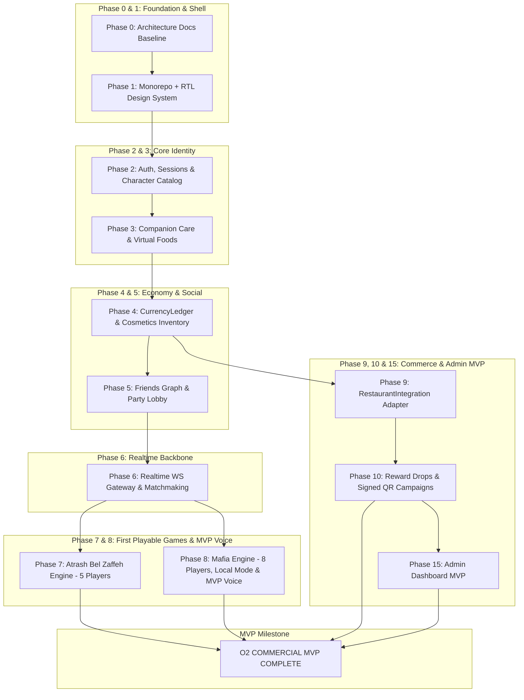

# O2 Universe — Development Roadmap & Dependency Architecture
**Document Version:** 1.1.0 (Phase 0 Revised Baseline)  
**Status:** Approved Architectural Baseline

---

## 1. Scope Breakdown: Prototype vs. MVP vs. V1 vs. Later

```
┌─────────────────────────────────────────────────────────────────────────────┐
│                          O2 SCOPE MATURITY STAGES                           │
├─────────────────────┬───────────────────────────────────────────────────────┤
│ STAGE               │ CORE DELIVERABLES                                     │
├─────────────────────┼───────────────────────────────────────────────────────┤
│ 1. Prototype        │ • Monorepo shell & RTL Design System tokens           │
│ (Foundational Proof)│ • Data-driven character starter catalog               │
│                     │ • Companion care interaction (feed/bathe/sleep loop)  │
│                     │ • Mock virtual food store                             │
│                     │ • Realtime WebSocket handshake & echo test            │
├─────────────────────┼───────────────────────────────────────────────────────┤
│ 2. MVP              │ • Full Auth & Multi-Device Sessions                   │
│ (Commercial Demo &  │ • Authoritative Currency Ledger (Coins & Gems)        │
│ Restaurant Trial)   │ • Personal O2 Lobby with Party presence               │
│                     │ • GAME 1: Atrash Bel Zaffeh (5 players public)        │
│                     │ • GAME 2: Mafia (8 players public + local moderator   │
│                     │   + Phase 8 MVP VoiceService integration)             │
│                     │ • Mock RestaurantIntegration & QR Redemption flow     │
│                     │ • Reward Drops engine with digital cosmetic reveals   │
│                     │ • Base Restaurant Admin Portal (Users, QR campaigns)  │
├─────────────────────┼───────────────────────────────────────────────────────┤
│ 3. V1 Commercial    │ • GAME 3: O2 Imposter (Mode A: Restaurant Sabotage)   │
│ Release             │ • GAME 4: Tarneeb (4 players 2v2)                     │
│                     │ • GAME 5: O2 Hide & Seek prototype map                │
│                     │ • Spatial Game Runtime Adapter boundary               │
│                     │ • Live O2 Branch POS / Webhook Integration            │
│                     │ • Daily Missions, Achievements & Title system         │
│                     │ • Physical reward budget caps & financial analytics   │
├─────────────────────┼───────────────────────────────────────────────────────┤
│ 4. Later Versions   │ • Seasonal LiveOps & O2 Journey progression track     │
│ (Live-Service Scale)│ • Classic Imposter Mode B                             │
│                     │ • Ranked Tarneeb Tournaments & Leaderboards           │
│                     │ • Native/Embedded 3D Game Client upgrades             │
│                     │ • Seasonal restaurant event maps (Ramadan, Summer)    │
└─────────────────────┴───────────────────────────────────────────────────────┘
```

---

## 2. MVP Dependency Graph



---

## 3. Detailed Phase Sequence & Engineering Plan

### Phase 0: Product Foundation (Current Phase — Complete)
* Architectural blueprints, data domain models, real-time protocols, threat models, and roadmaps.

### Phase 1: Design System & Monorepo Shell
* Initialize Turborepo (`apps/mobile`, `apps/admin`, `apps/api`, `packages/game-core`, `packages/ui`, `packages/types`).
* Implement base design system tokens: O2 Brand Red, dark navy surfaces, custom typography, RTL Arabic base layout, and foundational UI primitives (Button, Card, Modal, CurrencyBar, Dialog, Toast).

### Phase 2: Authentication & Mascot Selection
* Implement Google OAuth, Apple Sign-In architecture, and Email/Password with Argon2id.
* Implement multi-device `UserSession` management with refresh-token rotation.
* Seed starter characters into the data-driven `Character` table.

### Phase 3: Character Companion & Virtual Care
* Implement time-decayed care state machine (Hunger, Cleanliness, Energy, Mood) computed on the server.
* Build the interactive Personal O2 Lobby and virtual O2 food catalog.

### Phase 4: Authoritative Economy & Inventory
* Build the PostgreSQL `CurrencyLedger` and `WalletBalance` tables with ACID transaction guarantees for Coins, Gems, and scoped Event Tokens.
* Build inventory, single authoritative `EquippedCosmetic` slots, `CosmeticVariant` character compatibility, and the in-game Shop.

### Phase 5: Social Graph & Party Lobby
* Implement friend requests, user blocking, real-time presence (online/in-match), and persistent Parties with room codes and deep links.
* Display party members' companions standing together in the host's O2 lounge.

### Phase 6: Real-Time Networking & Matchmaking
* Deploy NestJS WebSocket gateway with JWT authentication and Redis-backed state management.
* Build per-room sequential action queues and fixed-size matchmaking queues (Mafia: 8, Atrash: 5, Tarneeb: 4, Hide & Seek: 8).

### Phase 7: Game 1 — Atrash Bel Zaffeh (أطرش بالزفة)
* Implement deterministic 5-player state machine, secret context distribution, timed turns, voting, and question packs (O2 Food, Culture, Palestine, Cinema).

### Phase 8: Game 2 — Mafia + MVP VoiceService
* Implement 8-player human matchmaking, secret roles, day/night cycles, voting, spectator isolation, and local moderator mode.
* Integrate MVP `VoiceService` with phase-gated publish permissions (mute during night phase, spectator audio isolation).

### Phase 9: O2 Restaurant Integration
* Implement the `RestaurantIntegration` interface with verified order callbacks, branch selectors (Gaza, Nuseirat), and mock adapters.

### Phase 10: Reward Drops & Secure QR Campaigns
* Implement the Reward Drops engine with reveal particle animations, Receipt QR vs Campaign QR flows, anti-replay nonces, and atomic physical voucher budget caps.

### Phases 11–18 (V1 & Live-Service Expansion)
* Phase 11: O2 Hide & Seek prototype with `SpatialGameClient` abstraction.
* Phase 12: O2 Imposter (Mode A: Restaurant Sabotage & Mode B: Classic).
* Phase 13: Tarneeb (4 players 2v2).
* Phase 14: LiveOps (Daily Missions, Achievements, Titles, Seasons).
* Phase 15: Full Admin Portal with live analytics and moderation.
* Phase 16: Push notifications & retention worker jobs.
* Phase 17: Security auditing & load testing (100K registered user capacity validation).
* Phase 18: Production release packaging for Android and iOS.

---

## 4. Open Questions Requiring Product Owner Decision

> [!IMPORTANT]
> The following product and technical decisions must be clarified by the Product Owner before advancing beyond early foundation phases:

1. **Restaurant POS Technical Interface:**
   * Does O2 currently use an off-the-shelf POS (e.g., Foodics, Sapaad, custom web portal) with existing webhook capabilities, or should Phase 1 assume our backend provides the primary webhook ingestion specification for O2's developers to call?
2. **Account Linking on Physical Orders:**
   * When a customer orders at the physical branch counter or via phone/WhatsApp, how will the cashier associate the order with the player's account? (Options: Customer shows a 6-character Player Code / QR from the app, provides phone number, or scans a printed receipt QR code after receiving the bill).
3. **Tarneeb Variant Preferences:**
   * What is the primary scoring target desired for the O2 community: Standard 41, or 61/31 variations?
4. **Physical Voucher Claim Workflow:**
   * When a player wins a physical reward drop (e.g., Free Gelato or 15% discount), how should branch staff validate and burn the voucher at the counter? (Recommended: Cashier scans an in-app dynamic one-time barcode/QR via a simple staff view in the Admin dashboard).
