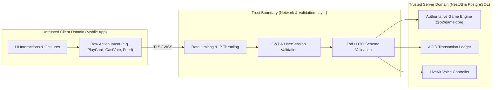

# O2 Universe — Security Architecture & Threat Model
**Document Version:** 1.1.0 (Phase 0 Revised Baseline)  
**Status:** Approved Architectural Baseline

---

## 1. STRIDE Threat Model Analysis

```
┌─────────────────────────────────────────────────────────────────────────────┐
│                            O2 STRIDE THREAT MATRIX                          │
├─────────────────────┬───────────────────────┬───────────────────────────────┤
│ THREAT CATEGORY     │ POTENTIAL ATTACK      │ MITIGATION STRATEGY           │
├─────────────────────┼───────────────────────┼───────────────────────────────┤
│ Spoofing            │ • Fake order claims   │ • Server-to-server HMAC       │
│                     │ • Fake user session   │   webhooks & signed QR tokens │
│                     │ • Impersonating admin │ • Argon2id, JWT, OAuth 2.0    │
│                     │                       │ • Strict RBAC Guards          │
├─────────────────────┼───────────────────────┼───────────────────────────────┤
│ Tampering           │ • Modifying Coins/Gems│ • Authoritative ledger with   │
│                     │ • Modifying card deck │   PostgreSQL row-level locks  │
│                     │ • Tampering with votes│ • Server-only game state      │
├─────────────────────┼───────────────────────┼───────────────────────────────┤
│ Repudiation         │ • Denying QR claim    │ • Append-only immutable       │
│                     │ • Denying admin ban   │   `CurrencyLedger` & `AuditLog`│
├─────────────────────┼───────────────────────┼───────────────────────────────┤
│ Information Leakage │ • Sniffing Mafia roles│ • Per-player state projection │
│                     │ • Sniffing Tarneeb hand│  (secret data never sent to   │
│                     │ • Exposing Auth tokens│  unauthorized clients)        │
├─────────────────────┼───────────────────────┼───────────────────────────────┤
│ Denial of Service   │ • WebSocket spamming  │ • Redis leaky-bucket throttle │
│                     │ • Matchmaking flooding│ • Connection limits per IP    │
│                     │ • Excessive QR scans  │ • Sequential room actor queues│
├─────────────────────┼───────────────────────┼───────────────────────────────┤
│ Elevation of        │ • Player gaining admin│ • NestJS Guard metadata       │
│ Privilege           │ • Unmuted spectator in│ • Server-managed voice tokens │
│                     │   Mafia night phase   │   with server-driven state    │
└─────────────────────┴───────────────────────┴───────────────────────────────┘
```

---

## 2. Client vs. Server Trust Boundary



### Core Axioms
1. **Never trust client claims:** The server never accepts packets claiming economic balances or match outcomes. Clients submit only atomic intent actions, and the server assigns authoritative event timestamps, validates rules, advances state, and calculates rewards.
2. **Per-Player State Projection:** Secret state (hidden cards, Mafia roles, saboteur identities) is stored in server memory and redacted prior to client transmission.

---

## 3. Multi-Device Sessions & Storage Security

* **Multi-Device `UserSession` Model:**
  * Each login generates a distinct `UserSession` row with a `familyId` for refresh-token rotation.
  * Replayed or compromised refresh tokens trigger immediate revocation of the entire token family.
* **Token Lifespans:**
  * **Access Token:** Short-lived JWT (15 minutes).
  * **Refresh Token:** Long-lived (30 days), stored as an Argon2id/SHA-256 hash.
* **Mobile Secure Storage:** Sensitive credentials are stored in hardware-backed secure storage (`react-native-keychain` / `expo-secure-store` utilizing iOS Keychain and Android KeyStore).

---

## 4. QR Security Architecture & Anti-Replay

```
┌───────────────────────────────────────────────┬───────────────────────────────────────────────┐
│ A. RECEIPT / ORDER QR                         │ B. EVENT / BRANCH CAMPAIGN QR                 │
├───────────────────────────────────────────────┼───────────────────────────────────────────────┤
│ • Uniquely bound to a single physical order.  │ • Multi-user promotional campaigns.           │
│ • Enforced via `orderReference` UNIQUE index. │ • Enforced via `(qrCampaignId, userId)` UNIQUE│
│ • Replay rejection: Cannot be claimed twice.  │   (1 redemption per eligible account).        │
└───────────────────────────────────────────────┴───────────────────────────────────────────────┘
```

* **Cryptographic Key Separation:**
  * Database rows store `signingKeyId` instead of raw plaintext secrets.
  * Backend verifies signatures by fetching the active key from KMS / environment variables.
* **Payload Verification:**
  1. Signature verified with `HMAC-SHA256(payload, key)`.
  2. Timestamp checked against expiration (`expiresAt > Date.now()`).
  3. `tokenNonce` uniqueness checked in `QRRedemption`.

---

## 5. Moderation & Community Safety

* **Reporting System:** Captures room context, recent chat snippets, and match IDs.
* **Moderation Actions:** Mute, Matchmaking Suspension, and Account Ban enforced via NestJS Auth Guards.
* **Audit Logging:** Every administrative action is written to the immutable `AuditLog` table with IP, previous state, and new state.
